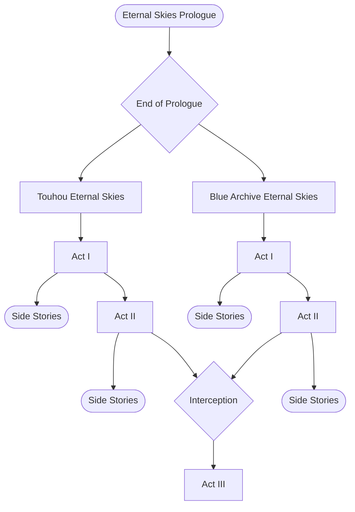

```mermaid
flowchart TB

    A(["Eternal Skies Prologue"]) --> B{"End of Prologue"}

    B --> C["Touhou Eternal Skies"] & D["Blue Archive Eternal Skies"]

    C --> E["Act I"]

    E --> n1(["Side Stories"]) & n2["Act II"]

    n3["Act I"] --> n4(["Side Stories"]) & n5["Act II"]

    D --> n3

    n2 --> n6(["Side Stories"]) & n9["Interception"]

    n5 --> n7(["Side Stories"]) & n9

    n9 --> n8["Act III"]

  

    n2@{ shape: rect}

    n3@{ shape: rect}

    n5@{ shape: rect}

    n8@{ shape: rect}

    n9@{ shape: diam}
```